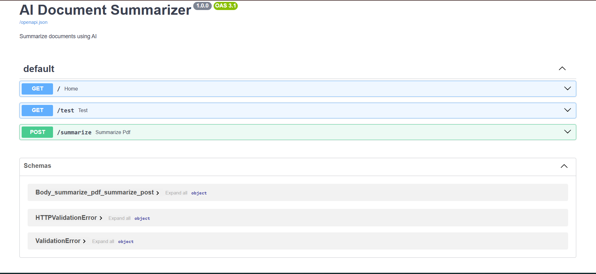
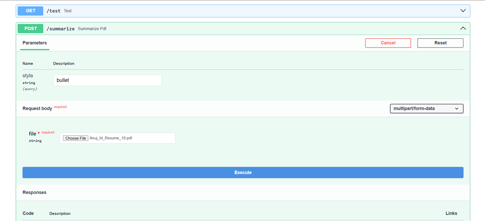
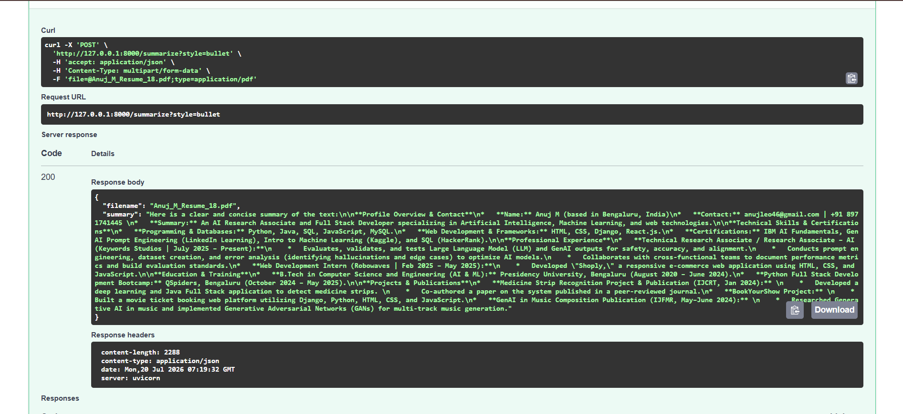

# AI Document Summarizer

AI-powered document summarization API built using FastAPI and Google's Gemini API.

## Features

- 📄 Upload PDF documents
- 🤖 AI-generated summaries using Gemini
- 📝 Multiple summary styles
- ⚡ FastAPI REST API

## Screenshots

### API Documentation



### Upload PDF



### AI Summary



## Tech Stack

- Python
- FastAPI
- Google Gemini API
- PyPDF2
- Uvicorn

## Installation

```bash
git clone https://github.com/anuj1102001/AI-Document-Summarizer.git

cd AI-Document-Summarizer

python -m venv .venv

source .venv/bin/activate
```

Install dependencies

```bash
pip install -r requirements.txt
```

Create a `.env`

```text
GEMINI_API_KEY=YOUR_API_KEY
```

Run

```bash
uvicorn app.main:app --reload
```
